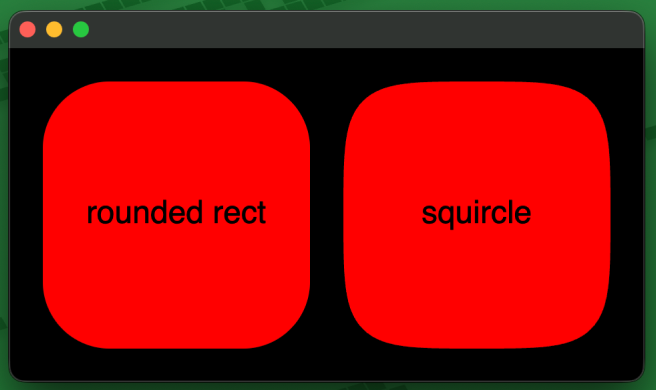

# GPUI Squircle

> A squircle component for gpui.



## Installation

```sh
gpui_squircle = "0.1.0"
```

## Usage

```rs
use gpui::{ParentElement, Styled, div, px};
use gpui_squircle::{squircle, SquircleStylable};

fn squircle_div() -> impl gpui::IntoElement {
    div()
        .size(px(200.))

        .child(
            // To use a squircle simply parent it to an element.
            // It's size automatically fills the entire parent. 
            squircle()
                .rounded(px(25.))
                .bg(gpui::red())
                .border(px(15.))
                .border_color(gpui::blue())
                .border_outside()
        )
}
```

## Examples

Examples can be found [here](/examples)